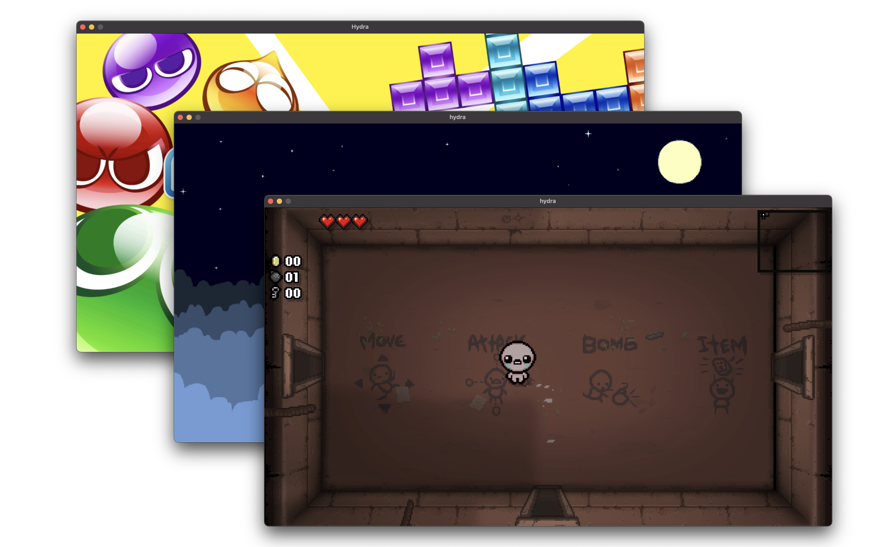

# Hydra

Hydra is an experimental Nintendo Switch emulator for macOS.

## Status

The emulator is still in very early stages. A few games and homebrew apps work perfectly, but most will either crash or have issues that make them unplayable.



Only the NRO, NCA and NX formats are supported. You can convert an NSP file to NCA with [this tool](https://github.com/SamoZ256/switch-extract-macos), and NSP to NX with [this tool](https://github.com/SamoZ256/herakles).

In order to run official games, you will need to download a set of patches to prevent crashes. You can get the patches together with a guide on how to install them [here](https://github.com/SamoZ256/hydra-patches).

## Usage

You can download the latest release from [here](https://github.com/SamoZ256/hydra/releases/latest).

### Dependencies

You can install Hydra dependencies with a package manager of your choice, like `brew`.

```sh
brew install cmake ninja sdl3 fmt
```

### Building

First, clone the repository and update submodules.

```sh
git clone https://github.com/SamoZ256/hydra.git
cd hydra
git submodule update --init --recursive
```

Now configure CMake and build with Ninja.

```sh
cmake . -B build -G Ninja -DMACOS_BUNDLE=ON
ninja -C build
```

You will find a macOS app at `build/bin/Hydra.app`. If you want to use the SwiftUI frontend instead of `SDL3`, you can use the `-DFRONTEND=SwiftUI` option.

### Configuring

You can find a config file at `~/Library/Application Support/Hydra/config.toml` after launching the emulator at least once.

#### Firmware

Some games require firmware files from a Nintendo Switch console to function properly. The firmware files need to be decrypted, which can be done with [this tool](https://github.com/SamoZ256/switch-extract-macos).

To use the firmware, set the `firmware_path` option in the config file to the path of the decrypted firmware files.

## Contributing

Pull requests are very welcome. Feel free to join the official [Discord server](https://discord.gg/FZ742SWv8f) for better communication.
