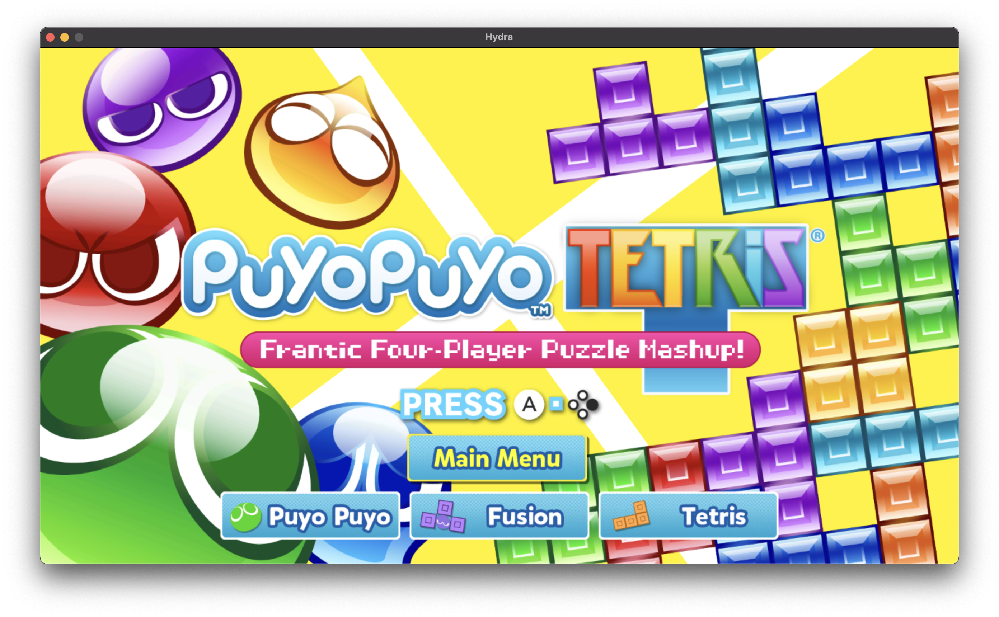

# Hydra

Hydra is an experimental Nintendo Switch emulator for macOS.

## Status

The emulator is still in very early stages. A few homebrew games work perfectly, and one official game, Puyo Puyo Tetris, is almost playable.



In order to run official games, you will need to download a set of patches to prevent crashes on startup. You can get the patches together with the guide on how to install them [here](https://github.com/SamoZ256/hydra-patches).

Only the NRO and NCA formats are supported. Additionally, all NCAs need to be decrypted with a third-party tool like [hactool](https://github.com/SciresM/hactool).

## Usage

### Dependencies

You can install Hydra dependencies with a package manager of your choice, like `brew`.

```sh
brew install fmt
```

### Building

First, clone the repository and update submodules.

```sh
git clone https://github.com/SamoZ256/hydra.git
cd hydra
git submodule update --init --recursive
```

You will need to find your codesigning identity in order to build.

```sh
security find-identity -p codesigning
```

Now configure CMake and build with Ninja.

```sh
cmake . -B build -G Ninja  -DCODESIGN_IDENTITY="Apple Development: SOMETHING (XXXXXXXXXX)"
ninja -C build
```

If you want to use the SwiftUI frontend instead of SDL3, you can use the `-DFRONTEND=SwiftUI` option.

### Running

You can run the emulator with the following command:

```sh
src/frontend/hydra
```

If you are using the SDL3 frontend, you also need to provide a path to a ROM:

```sh
src/frontend/hydra /path/to/rom
```
